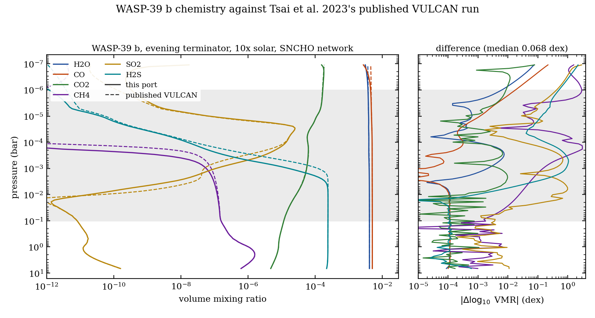
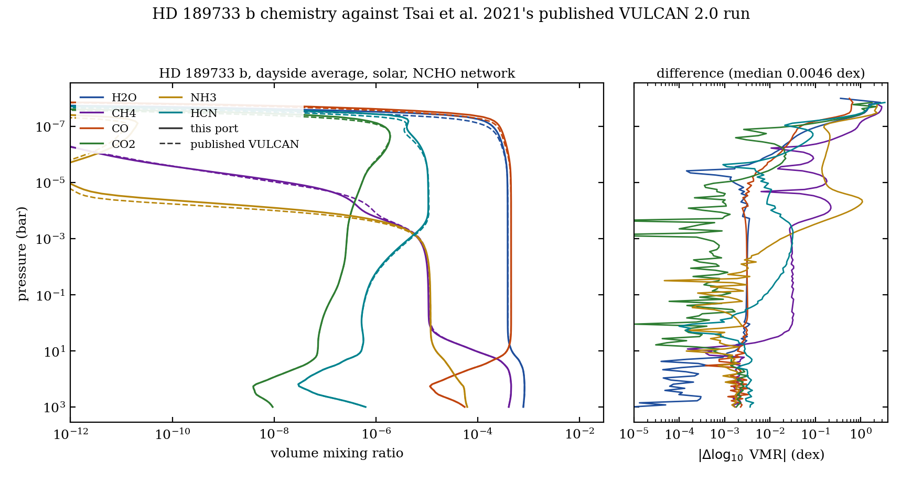
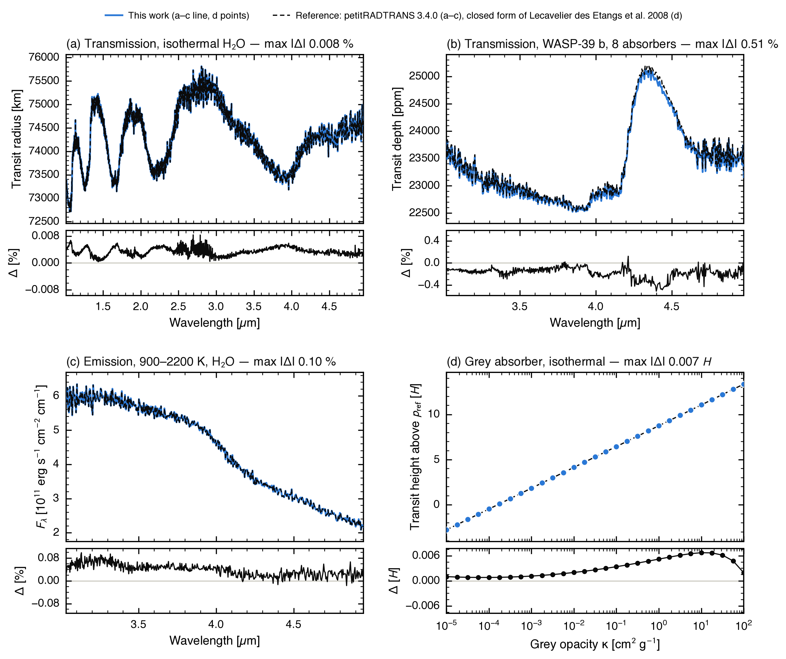
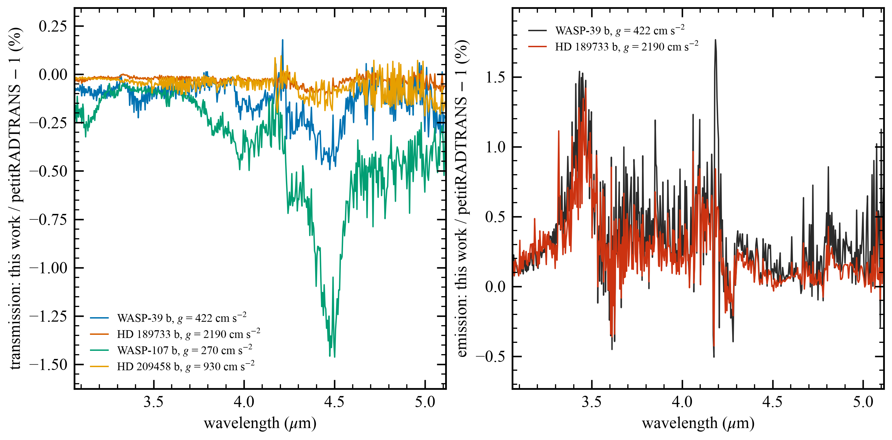
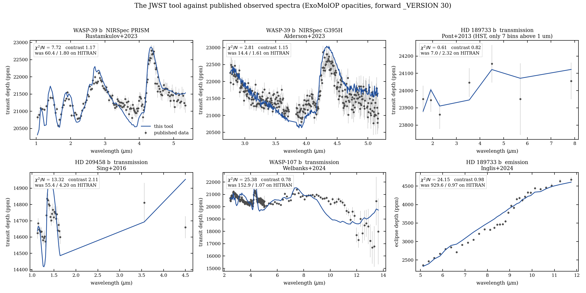
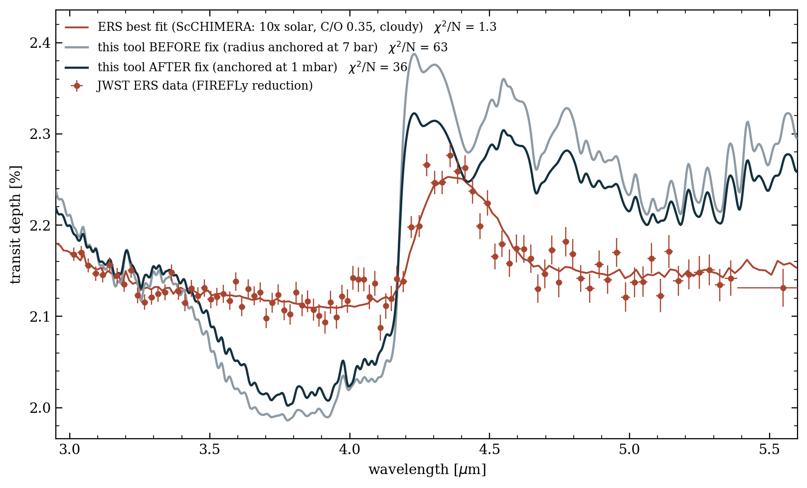

# vulcan-forward

vulcan-forward computes exoplanet atmosphere spectra. It runs
[VULCAN-JAX](https://github.com/imalsky/jax-vulcan) photochemical kinetics to get
the chemical abundances. It then runs
[ExoJAX](https://github.com/HajimeKawahara/exojax) radiative transfer to get a
transmission or emission spectrum. The whole chain is differentiable, so you can
compute derivatives of the spectrum with respect to the model parameters.

Two applications use this engine. Each one depends on this package. Neither one
depends on the other:

```
vulcan-jax          chemistry kernels and the steady-state solver
      |
vulcan-forward      this package: chemistry driver and radiative transfer
      |
      +-- vulcan-retrieval     atmospheric retrieval (SMC sampler)
      +-- vulcan-jwst-tool     JWST observation planner
```

The package name is `vulcan-forward`. The import name is `vulcan_forward`.

## Modules

| Module | Contents |
|---|---|
| `constants` | Physics constants and the default molecule table |
| `paths` | The location of the external data files |
| `vulcan_chem` | The chemistry driver. It computes converged volume mixing ratios from the model parameters |
| `interp_map` | Interpolation from the chemistry pressure grid to the radiative-transfer pressure grid |
| `exojax_rt` | Opacities, collision-induced absorption, and the radiative transfer. It returns a transit depth or an emergent flux |
| `ckd` | Correlated-k core: the quadrature, the band grid, the (T, P) interpolation, and the mixture overlap |
| `exomolop` | Adapter for the published ExoMolOP k-tables (the default opacity source) |
| `fetch_exomolop` | Offline command that resolves and downloads those tables |

## Install

```bash
pip install -i https://test.pypi.org/simple/ --extra-index-url https://pypi.org/simple vulcan-forward
```

To install from a local copy of the repository:

```bash
pip install --no-deps -e .
```

Use `--no-deps` because vulcan-jax is on TestPyPI and not on PyPI.

## Import order

Import `vulcan_chem` before you import anything from exojax. This order is
necessary. `vulcan_chem` does two things when Python imports it. It sets the
`VULCAN_JAX_*` environment variables that select the reaction network. It also
enables 64-bit floating point in jax. VULCAN-JAX and exojax read both of these
settings only once, at their own first import. A later change has no effect.

Use this order:

```python
from vulcan_forward import constants, vulcan_chem, interp_map, exojax_rt
```

`vulcan_chem` stops with an error if exojax is already imported. It also stops
with an error if `vulcan_jax` is already imported with a different reaction
network. In that condition the package cannot apply the network selection. The run
would then fail at a later step. Its message would name the environment
variable, not the import order.

## Data files

This package needs four sets of data files at run time:

- the ExoMolOP k-tables (the default opacity source),
- the HITRAN and ExoMol line lists (the `lbl` fallback path),
- the offline opacity cache, which holds the cached carbon-monoxide line list,
- the two collision-induced absorption (CIA) tables, for H2-H2 and H2-He.

These files are tens of gigabytes, so the package does not include them. Tell the
package where they are:

```bash
export VULCAN_FORWARD_DATA="$HOME/vulcan/forward-data"
```

The package expects three directories below that root:

```
exojax_linelists/     HITRAN and ExoMol caches (downloaded on first use)
opacity_cache/        cached carbon-monoxide line list, H2-H2 and H2-He CIA tables
exomolop/             ExoMolOP k-tables (fetched offline; ~389 MB per species)
```

Loading a k-table reads its wavelength window into memory as float64: about
200 MB per species over the full 1-15 um planner window, so budget a few GB of
RAM for a many-species run.

You can move one directory without moving the other. Set
`VULCAN_FORWARD_LINELISTS` or `VULCAN_FORWARD_OPACITY_CACHE` to do this. An
application with its own configuration can instead call
`vulcan_forward.paths.set_data_root(...)`.

The root does not have to exist yet. A setup command creates the layout with
`vulcan_forward.paths.ensure_layout()`. A model build never creates directories:
it reports a missing one as an error.

The package reads no file until it needs one. If a file or directory is missing,
the package stops and shows the path and the remedy. The H2-He CIA table is
required physics, because helium is about 14% of the atmosphere by number. A
missing H2-He table stops the run. The package never continues without that
absorption.

## Planet geometry is required

`build_rt_model` needs three values in its profile: `rp_cm` (the planet radius in
centimeters), `gs_cgs` (the surface gravity in cm/s^2), and `rstar_cm` (the
stellar radius in centimeters). These values set the transit-depth normalization
and the atmospheric scale height. There is no safe default value, so the function
stops with an error if one is missing.

Earlier versions of this code used WASP-39 b values when a key was absent. A
caller who forgot one key then modeled a different planet. No message reported
the substitution.

### Where the radius applies: `p_ref_bar`

A radius is only meaningful with a pressure attached to it. `p_ref_bar` (default
1e-3 bar) is the pressure at which `rp_cm` and `gs_cgs` are taken to apply, and
the engine converts hydrostatically from there to the level exojax needs.

Before version 0.4.0 there was no conversion: the caller's values went straight
to exojax as `radius_btm`/`gravity_btm`, which exojax defines at the bottom of
the RT grid (7 bar). A published planet radius is the transit radius, near the
terminator photosphere at roughly a millibar, so the whole 7 bar to millibar
column was stacked on top of a radius that already was the photospheric one.
Measured on WASP-39 b, that put the modeled transit depth at 26,754 ppm against
a published 21,381, with 1.42 times too much spectral contrast.

Two notes for callers:

- The reference pressure and the reference radius are strongly degenerate in
  transmission. A forward model has to fix both, so this is an input, not a
  result. Depth shifts by roughly 4.6 (H/Rp) per decade of `p_ref_bar`, which is
  4.7 percent per decade for WASP-39 b. Feature shapes are second order and
  barely move. Quote absolute depths with that caveat.
- A retrieval that INFERS a reference radius should pin `p_ref_bar` to whatever
  its prior was built around, because changing it slides the fitted radius by
  the same amount. `vulcan-retrieval` pins it explicitly for this reason.

Emission anchors separately, at `p_ref_emission_bar` (default 0.1 bar). The
dayside photosphere sits about two decades deeper than the limb, so a single
anchor cannot serve both geometries. `build_emis_model` exposes
`emission_radius(T, mmw)` for the eclipse-depth prefactor; using the catalogue
transit radius with the emission column's gravity implies a planet mass 8.9
percent off its own GM.

This is still a SINGLE radius. The fully correct prefactor is the
wavelength-dependent radius at vertical optical depth 2/3 (Fortney, Lupu,
Morley, Freedman and Hood 2019, ApJL 880 L16), which biases planet-to-star flux
ratios by about 5 percent typically and 10 to 25 percent for low-gravity hot
Jupiters. Not implemented.

### The emission column has to be opaque at its bottom

`build_emis_model` runs exojax's `ibased_linsap` solver, which carries an
interior source term: the deepest boundary temperature, attenuated by
`exp(-tau_total/mu)`. That term is an isothermal-interior assumption standing in
for everything below the grid, so a column that leans on it is reporting an
assumption rather than a model. Consumers should check `tau_bottom` and refuse a
transparent column; the fix is a deeper `art_pbtm_bar`, not a wider tolerance.

Before 0.5.0 the solver was `ibased`, which drops the term entirely. Photons
entering from below were simply lost, and at the marginal optical depths a
consumer gate typically admits that is 12 to 52 percent of the flux. `linsap` is
also the more accurate scheme at production layer counts: at 60 layers and
bottom optical depth 10 it sits within 0.13 to 0.40 percent of its own converged
answer where `ibased` sits 2.9 to 5.3 percent away.

## Opacity: correlated-k, not sampled line-by-line

exojax evaluates a cross section **on the wavenumber grid it is handed**. There
is no internal high-resolution grid, and its own `wavenumber_grid` calls
`warn_resolution(R, crit=700000.0)`, so any grid below R = 700,000 is outside
the regime its opacity calculators are built for. A JWST-band model at
R ~ 1,500 is therefore not line-by-line: it is a strided sample of a spectrum
that was never resolved, and the error does not average out. It is worst where
lines are strong and sparse, so it inflates spectral **contrast**, not just the
level.

Measured on WASP-39 b, with the published Tsai et al. 2023 chemistry, T-P
profile, geometry and pressure grid held fixed, binned to R = 100 over
1.02-5.3 um and compared with the JWST NIRSpec PRISM data:

| opacity path | contrast vs data | fitted radius offset |
|---|---|---|
| R = 1,477 (the old default) | 2.80x | -2995 ppm |
| R = 700,000 line by line | 1.93x | -1483 ppm |

Reaching R = 700,000 over 1-15 um is 5.1 million grid points, which does not
fit in one array and takes ~20 minutes per spectrum even chunked. Correlated-k
does that integration **once, offline**, and compresses each band to `ng`
Gauss-Legendre ordinates. Validated against the R = 700,000 line-by-line
spectrum on the same atmosphere, ng = 16, R = 500 bands: **32 ppm rms, 171 ppm
worst bin**, against a 105 ppm median data uncertainty, in **2.8 s** per
spectrum.

The k-tables themselves come from ExoMolOP (next section), fetched once into
`$VULCAN_FORWARD_DATA/exomolop/`. `load_tables` **raises** with the exact
fetch command if one is missing: tables are never fetched at run time, because
a silent download would turn a one-line config error into 389 MB of network
traffic behind the caller's back.

(History: 0.6.0-0.7.x carried an interim `opacity_mode="ckd"` that built
k-tables locally from HITRAN at R = 700,000; the numbers above were measured
with it and validate the correlated-k machinery itself. It was removed in
0.8.0 -- ExoMolOP superseded its line data, which was measurably wrong for a
hot hydrogen atmosphere in the three ways the next section quantifies.)

Mixtures use **random-overlap resort-rebin** (`ckd.overlap`). exojax 2.2.3
ships no overlap treatment at all: `opacity_profile_xs_ckd` takes one species,
and tables have to be per species because the composition changes every run.
The rebin is written in JAX and is differentiable, so forward-mode tangents
still reach the spectrum.

Leave-one-out spectra reuse the fold (0.9.0): `transmission_depth_r` and the
emission model's `emission_flux_tau` take a `wo_mols` list and compute the
full spectrum plus every removed-molecule spectrum in one pass. The fold is a
fixed-order left fold, so the running prefix over molecules 0..i-1 is shared
between the full spectrum and every wo spectrum with a later drop index; the
dropped molecule is still folded, as the exact-zero tensor its zeroed VMR
produces, so each output is bit-identical to a from-scratch solve (op order
is load-bearing -- the rebin is neither associative nor an exact identity on
a zero operand; `ckd._fold_wo` documents and `tests/test_ckd.py` pins the
contract). `emission_flux_tau` also builds the optical depth once for the
flux and the bottom-tau certificate, where the separate calls built it twice.
Measured on the planner's default 5-molecule WASP-39 b case: the emission
run's spectrum block fell from ~150 s to ~50 s, transmission's from ~56 s to
~42 s, bit-identical outputs.

### Emission uses it too (0.7.0), and needed it more

Emission was hit far harder than transmission, because flux carries
`exp(-tau)` where a transit depth carries `ln(tau)`: the same "too opaque"
sampling bias that costs transmission a percent-level contrast error
suppresses most of the emergent flux. Measured over 3-5 um against an
R = 700,000 emission reference on the identical atmosphere:

| opacity path | band-integrated flux | rms per R=100 bin | spectral contrast |
|---|---|---|---|
| R = 1,477 sampled | **45%** of correct | 58.7% | 69.9% |
| correlated-k | 100.5% of correct | 1.9% | 47.3% |
| R = 700,000 reference | (definition) | -- | 47.5% |

The path is `_run_emis_ckd_linsap`, **not** exojax's `ArtEmisPure.run_ckd` --
upstream's version hard-codes `rtrun_emis_pureabs_ibased`, the solver with no
interior source term, and calling it would silently undo the `ibased_linsap`
fix (measured: it returns 22-99% less flux on a thin column). Ours is
upstream's own flatten-solve-reweight with `ibased_linsap` substituted.

Emission's 1.9% is looser than transmission's 32 ppm (0.16%), and that is
physics rather than a plumbing defect: a transit depth is a chord integral
that saturates, while the emergent flux weights every layer by a source
function, so it feels the correlated-k assumption -- that the k-ordering is
the same at every level -- much more directly. The worst bins are 4.2-4.4 um,
the CO2 band edge, which is exactly where a strong band's wings decorrelate
across the column. For scale, the single-radius eclipse prefactor this engine
already documents is a ~5% effect on the same spectrum.

## Opacity data: ExoMolOP, not HITRAN

Correlated-k fixed HOW the opacity is integrated. It did not fix WHAT is
integrated, and the line data was wrong for this problem in three measured
ways, all pushing opacity DOWN in the windows and so inflating contrast:

| defect | measured |
|---|---|
| HITRAN is a 296 K database | H2O band-mean cross section vs POKAZATEL at 1200 K: 0.01 dex low in the 2.7 um core, 0.20 at 1.65, 0.45 at 3.7, **0.85 dex at 1.03 um** |
| the perturber was terrestrial **air**, in a hydrogen atmosphere | CO2's H2/He Lorentz widths are **1.46x** the air widths at 100% line coverage; **H2O has 0% H2/He coverage in HITRAN**, so `broadening="h2he"` returns a ratio of exactly 1.000 and cannot fix the dominant absorber |
| 5 species | against the published comparison model's 24 |

**ExoMolOP** (Chubb et al. 2021, A&A 646, A21) closes all three at once. It
publishes pre-computed opacities for ~80 species, built from the ExoMol and
HITEMP high-temperature line lists with H2/He broadening already applied, free
and with no account, in each RT code's native format. Fetch them once:

    python -m vulcan_forward.fetch_exomolop --molecules H2O,CO2,CO,CH4,SO2,H2S

About 389 MB per species into `$VULCAN_FORWARD_DATA/exomolop/`, with a
`provenance.json` recording which ExoMol dataset each file came from. The
download URLs are resolved by walking ExoMolOP's pages, never guessed: the
filenames do not follow one pattern (H2O uses `__R1000`, everything else
`.R1000`). Where ExoMolOP publishes a natural-abundance file it is preferred
over the principal isotopologue, because VULCAN tracks a total molecular VMR.

`vulcan_forward.exomolop` is an adapter, not a second opacity implementation:
it returns the pack the correlated-k core (`vulcan_forward.ckd`) consumes, so
the random-overlap mixing, the (T, P) interpolation and both solvers are
shared code. Two things
about their tables genuinely differ and both are handled rather than assumed:
their quadrature is petitRADTRANS' split scheme (8 Gauss-Legendre points on
[0, 0.9] plus 8 on [0.9, 1], which resolves the strong-line tail better than a
flat rule), and their pressure grid stops at 1e-5 bar so layers above it reuse
that entry, which `load_tables` prints. Their units were verified empirically
against our own HITRAN table rather than taken on trust: cm^2 per molecule.

Measured on WASP-39 b with the published Tsai et al. 2023 chemistry, T-P,
geometry and grid held fixed, R = 100 over 1.02-5.26 um:

| opacity | spectral amplitude | vs the PRISM data |
|---|---|---|
| R = 1,477 sampled, HITRAN | 1256 ppm | 2.80x |
| R = 700,000, HITRAN | 870 ppm | 1.94x |
| ExoMolOP, 5 species | 695 ppm | 1.55x |
| ExoMolOP, + H2S | 663 ppm | 1.48x |
| published gCMCRT | 622 ppm | 1.39x |
| the data itself | 448 ppm | 1.00x |

## Validation

Six figures, code-to-code first. The chemistry (computed by `vulcan-jax`,
which this package drives) is checked against VULCAN runs published by the
code's own authors; the radiative transfer is checked against petitRADTRANS
3.4.0 on identical inputs and against two closed-form answers. Comparisons
to observed spectra are an appendix: real data folds in aerosols, the
reduction, and correlated noise, which these tests are not trying to
measure.

| test | agreement |
|---|---|
| Chemistry, WASP-39 b vs Tsai et al. 2023 | 0.068 dex median (photosphere) |
| Chemistry, HD 189733 b vs Tsai et al. 2021 | 0.0046 dex median |
| Chemistry, upstream VULCAN on byte-identical inputs | 0.0048 dex median |
| Chemistry, archived VULCAN, matched inputs (Wogan et al.) | 0.01-0.05 dex per species |
| Transmission vs petitRADTRANS, same k-tables | mean ratio 1.00003, rms 0.0013% |
| Emission vs petitRADTRANS, same k-tables | mean ratio 1.00034, rms 0.020% |
| Transmission vs the analytic grey solution | 0.016 scale heights over 7 decades |
| Emission vs the blackbody limit | 6.7e-16, machine precision |
| Four real planets, both geometries, vs petitRADTRANS | 0.02-0.57% rms |

### Chemistry against the authors' published VULCAN runs



WASP-39 b against the run Tsai et al. 2023 (Nature 617, 483) released with
the paper: same T-P table, 10x solar, SNCHO network. **0.068 dex** median
over 11 species in the transmission photosphere (shaded). At the abundance
peaks, which are what a spectrum sees: H2O and CO 0.000 dex, CH4 0.002,
H2S 0.001, and SO2, the subject of their paper, 0.006.

The three species with visible photosphere differences (CH4 0.072, H2S
0.134, SO2 0.144 dex) are the quench- and photochemistry-sensitive ones,
and the difference is model-domain provenance, not the solver: their model
spans 50 to 5e-9 bar where this configuration runs 7.6 to 1e-7 bar. Two
matched-input controls pin that down. Upstream VULCAN run here on
byte-identical inputs agrees to **0.0048 dex** median (89 species, and it
reproduces the recorded 1202-step convergence). And on the Wogan et al.
re-run of this planet (11 bar to 5e-9 bar, their Kzz), VULCAN-JAX equals
local VULCAN-master to 0.000 dex and both match the archived published
VULCAN output to 0.01-0.05 dex per species, SO2 at 0.012
(`jax_paper/data/W39b_paper_match_comparison.md`).



HD 189733 b against Tsai et al. 2021 (ApJ 923, 264), matched to their
released config key for key: **0.0046 dex** median for the 17 species
peaking above 1e-6, over 11 decades of pressure. A different planet and a
different network (NCHO, no sulfur), so the WASP-39 b agreement is not a
one-case coincidence.

### The transmission RT is verified against petitRADTRANS



The engine's transmission path was checked against petitRADTRANS 3.4.0 reading
the **same k-table file**, so only the radiative transfer differs. Transit
radius, R = 100 to R = 1000, cloud-free:

| case | exojax vs pRT amplitude | rms |
|---|---|---|
| isothermal 1000 K, H2O only | 1.0002 | 0.0013% |
| isothermal 1000 K, 6 species | 1.0010 | 0.021% |
| Tsai et al. 2023 W39 b profile, 8 species | 0.986 | 24 ppm on 23,000 ppm |

Against the closed-form grey-absorber solution (Lecavelier des Etangs et al.
2008; de Wit & Seager 2013), with H/R small enough that the constant-gravity
assumption of that formula holds, `art.run` reproduces the analytic transit
radius to **0.012 scale heights** over five decades of opacity, with the exact
`dz/dln(kappa) = H` slope.

Hydrostatic geometry agrees with pRT to 0.04% in radius, and with Tsai et al.'s
own published z column to 0.5% in z(P) and a few percent in scale height across
the photosphere.

### Emission is verified the same way

Two checks, both on the emission path this package actually ships
(`_run_emis_ckd_linsap`):

- **Blackbody limit.** An isothermal column must emit exactly `pi*B(T)`
  wherever it is optically thick, whatever the opacity is. Measured at total
  optical depths of 1e2, 1e4 and 1e6: max error **6.7e-16**, machine precision.
- **Against petitRADTRANS**, same H2O k-table, a 900-2200 K profile over 1e-6
  to 100 bar, 3-5 um: bias **+0.034%**, rms 0.020%, worst band 0.091%,
  band-integrated flux ratio 1.00036, and the spectral contrast (std/mean)
  ratio 1.0004.

Units, since they are the usual trap: exojax returns flux per cm^-1 and
petitRADTRANS (`frequencies_to_wavelengths=True`) returns flux per cm of
wavelength. Convert with `F_lambda = F_nu_tilde * nu_tilde^2`.

#### Reference fixtures keep this verification testable

Three of the comparisons above are pinned as end-to-end tests
(`tests/test_e2e_rt_reference.py`): the isothermal H2O transit radius, the
Tsai et al. 2023 WASP-39 b 8-species transit depth, and the H2O emission
flux, each asserted per band against a committed petitRADTRANS spectrum in
`tests/data/prt_ref_*.npz`. Each fixture's `meta` (JSON inside the npz)
records the pRT version, the opacity files, the case constants, the full
generating pRT script, the achieved agreement and the asserted tolerances
(3x achieved). petitRADTRANS is never a test dependency; the pRT side
regenerates from the recorded scripts. A numpy-only companion
(`tests/test_e2e_fixtures.py`) runs in the dependency-light CI and refuses
silently regenerated or incomplete fixtures.

### Both geometries, four planets, the tool's own atmospheres



The atmospheres the JWST tool itself converges to (P, T, mean molecular
weight, all VMRs, geometry) handed identically to both codes, four planets
spanning g = 270-2190 cm/s^2 and T = 637-2246 K, over 3.03-5.17 um where
CIA and Rayleigh measure under 1 ppm. Transmission agrees to 0.02-0.25%
rms with mean ratios 0.998-1.000; emission to 0.18-0.57% rms. Feature
amplitude, the quantity a detection significance depends on, agrees to
0.5-2.2%.

### Appendix: against observed spectra



Context, not the validation. Each model is blurred to the instrument
line-spread function, integrated exactly over the published bins, and
scored with one estimator (validated by recovering the ERS team's own
chi2/N = 1.3 for their best-fit model). Every dataset improved with the
ExoMolOP opacity switch: WASP-39 b PRISM chi2/N 60.4 to 7.7 with the
contrast excess falling 1.80 to 1.17; HD 189733 b emission 930 to 24.



The record of the headline finding from the 2026-08-14 validation pass:
the first time the forward model met a published spectrum, the WASP-39 b
transit depth was 25% high with twice the spectral contrast, from a radius
anchored at the 7 bar column bottom instead of the millibar photosphere.
The chi2 numbers printed on this figure are HITRAN-era; the current
default scores 7.7 on the same bins (figure above).

### Comparing against the published gCMCRT spectra

Driven by the published Tsai et al. 2023 chemistry, T-P profile and geometry,
R = 100 over 3.05-4.95 um, terminator-averaged:

| | std | amplitude |
|---|---|---|
| published gCMCRT | 538 ppm | 2185 ppm |
| this engine | 622 ppm | 2361 ppm |
| the PRISM data | 444 ppm | 1776 ppm |

Amplitude ratio to the published spectrum 1.080, std ratio 1.155, shape
correlation 0.9949, and the scatter about a fitted offset is 102 ppm, 19% of the
spectral variation. The SO2-only differential the Zenodo set allows (east minus
east_nSO2) agrees to the same 7%: 233 ppm peak here against their 218 ppm.

Both models are cloud-free and both exceed the data's amplitude, the published
one by 1.04-1.11x and this engine by 1.18-1.23x. With the usual fitted offset,
chi2/N is 1.56 for the published spectrum and 2.65 here on G395H; 1.83 and 3.58
on PRISM over 3.05-4.95 um.

#### Reading the published spectra correctly

**This is the single biggest trap in the whole comparison, and getting it wrong
manufactures a 2.2x discrepancy that is not real.** The convention is fixed by
gCMCRT's own source, `src_gCMCRT/exp_3D_sph_atm_trans.f90`:

- L306 writes the header: `n_wl, H(1), H(n_lev)`, the grid's INNER and OUTER
  radii in cm.
- L403 sets `norm = (H(n_lev)^2 - H(1)^2) / (2 * Nph)`.
- L429 writes `wl, norm*T_trans, norm*T_trans_east, norm*T_trans_west`.
- `mc_k_source_pac_inc.f90` L86 samples the impact parameter uniformly in b^2,
  and `mc_k_raytrace.f90` L274-277 sets each packet's contribution to
  `wght * (1 - exp(-tau))`.

So column 2 is the Monte Carlo estimate of `int (1 - T(b)) b db`, an area over
2 pi, and the transit depth is

    depth = (H(1)^2 + 2 * col2) / Rstar^2

with `H(1)` the header's FIRST number, per file. Not `R_ref^2 + col2`: that
drops a factor of two on the atmospheric annulus and anchors to the wrong
radius, which halves the apparent amplitude.

Three independent checks that the above is right: it is what the source says; it
puts their 3-5 um photosphere at 7.1 to 0.0195 mbar, matching the paper's own
statement that transmission probes "between 10 and 0.01 mbar", where the wrong
reading gives 4 to 0.195 mbar; and it brings the amplitude into 8% agreement
with two independent radiative transfer codes instead of 2.2x disagreement.

Note that `H(1)` differs per file because the runs use different grid bottoms
(8.459827e9 for the full-range VULCAN east file, 9.143827e9 for the G395H one),
so two published files are NOT directly comparable without applying each file's
own header.

## The exojax version

This package requires exactly `exojax==2.2.3`. Four parts of `exojax_rt` depend on
the behavior of that version:

1. **Gravity profile.** `exojax_rt` computes its own gravity profile,
   `g(r) = g_btm (R_btm/r)^2`. The exojax function `gravity_profile` returns a
   value proportional to `1/r` instead, but the exojax height integrator states a
   dependence proportional to `1/r^2`. For WASP-39 b the measured difference in
   transit depth is +1.5 parts per million with the local profile, -101.8 parts
   per million with constant gravity, and -50.8 parts per million with the exojax
   profile.

   Those three numbers come from a 2026-07-28 audit against an independent chord
   quadrature on an isothermal gray column at 60 layers. The audit scripts
   (`verify_gravity_profile.py`, `verify_rt_transmission.py`) are cited in the
   `_gravity_profile_invsq` docstring but are NOT in this repository, so the
   numbers are not reproducible from a clean clone. What IS pinned here is the
   choice itself: `tests/test_gravity_profile.py` fails if the profile collapses
   to constant `g` or to the exojax `1/r` helper, or if the planet geometry
   stops being passed through. Reproducing the ppm figures needs the audit
   scripts restored; the regression test does not depend on them.
2. **Deprecated argument.** exojax deprecated the `dit_grid_resolution` argument
   and replaced it with `broadening_resolution`. The accepted format of the new
   argument applies to exojax 2.x only.
3. **Compatibility modules.** Two imports use `exojax.database.api` and
   `exojax.database.contdb`. Both modules state that a future major release will
   remove them.
4. **Broadening data.** The code writes `mdb.gamma_air` and `mdb.n_air` directly
   to apply H2/He line widths. This depends on the attribute names of the exojax
   database object.

exojax 2.2.3 also requires `numpy<2`. This package holds that limit, so
vulcan-jax does not have to. vulcan-jax needs only jax, numpy, scipy and PyYAML,
and users who want chemistry alone install nothing more.

## Scope and known work

The numerical core does not depend on any application. It takes the planet
geometry as arguments, and it contains no sampler concepts.

### Chemistry parameters

`vulcan_chem` has a named parameter type. Use it in new code:

```python
from vulcan_forward.vulcan_chem import ChemParams

params = ChemParams(lnZ=0.0, c_o=0.0, lnKzz=0.7, tp=(1200.0, -1.0))
y = chem.converged_y(params)
```

`lnZ` scales the metals. `c_o` moves carbon at fixed oxygen. `lnKzz` scales the
eddy-diffusion profile. `tp` holds the temperature parameters. The meaning of
`tp` is fixed when you build the model. With a `tp_eval` hook it is that hook's
parameter block. Without one it is a single uniform temperature offset in
kelvin.

Every function also accepts a positional vector, `[lnZ, c_o, lnKzz, *tp]`. Keep
that form for a sampler or for forward-mode automatic differentiation. In those
cases the parameters are a vector, and the tangent must have the same shape.
`params_from_vector` reads a vector into a `ChemParams`, and
`ChemParams.to_vector` writes one back.

The tests in this repository check the packaging rules only. Each test confirms
one rule:

- the package imports with no data installed,
- a missing data path stops the run and shows the remedy,
- an application can replace the molecule table,
- the planet geometry is required,
- the import-order check works.

The two applications validate the physics against real spectra.

## License

GPLv3, inherited from VULCAN.
